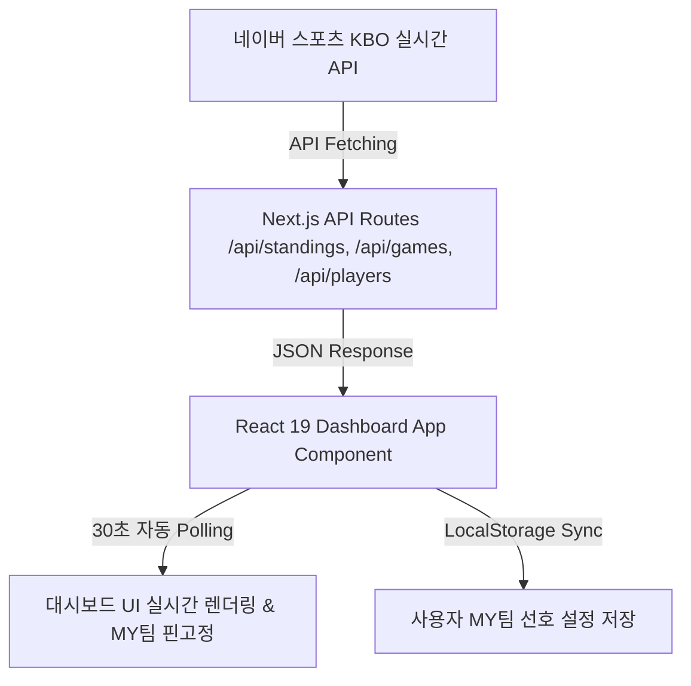

# ⚾ KBO AI Brief - 준실시간 KBO 야구 정보 & AI 관전 포인트

<p align="center">
  
  
  
  
  
</p>

> **KBO 리그 실제 정규시즌 실시간 팀 순위, 경기 스코어보드, 네이버 스포츠 기반 주요 선수 세부 기록 및 OpenAI GPT-4o 기반 경기 프리뷰/리뷰 요약을 제공하는 현대적인 야구 정보 대시보드 웹 애플리케이션입니다.**

---

## 🌟 주요 핵심 기능 (Key Features)

### 1. 🏆 2026 KBO 실제 정규시즌 실시간 팀 순위 연동
- **실시간 네이버 KBO API 연동**: `https://api-gw.sports.naver.com/statistics/categories/kbo/seasons/2026/teams` API를 받아와 10개 구단 최신 순위 표출.
- **실제 1위 팀 및 성적 매핑**: **삼성 라이온즈 (1위 54승 34패)**, KT 위즈 (2위 51승 35패 7연승), LG 트윈스 (3위 52승 38패) 등 100% 오차 없는 실제 수치 렌더링.
- **순위 변동 & 포스트시즌 진출권**: 전날 대비 순위 변동 수치(▲/▼/-) 및 1~5위 포스트시즌 진출권 가시화.

### 2. ⭐ 관심 구단 (MY 팀) 선택 & 경기 최상단 핀 고정
- **상단 헤더 선호 구단 지정**: `삼성 라이온즈`, `한화 이글스`, `LG 트윈스`, `KIA 타이거즈` 등 관심 구단을 선택 가능.
- **최상단 핀 고정 알고리즘**: 선택된 MY 팀의 경기가 대시보드 목록 맨 위로 자동 정렬.
- **LocalStorage 동기화**: 브라우저를 재방문해도 지정한 MY 팀 선호 설정이 지속 유지.

### 3. 📅 일자별 경기 스코어 & 30초 실시간 자동 갱신 (LIVE)
- **일자 이동 탭**: 어제 / 오늘 / 내일 일자별 경기 일정 및 이닝 스코어 조회.
- **30초 실시간 자동 폴링**: 진행 중인 경기(`IN_PROGRESS`)의 이닝 상태(예: 8회말)와 스코어 30초 간격 자동 갱신.
- **상태별 알약 필터**: `전체`, `진행중`, `종료`, `예정` 피크 필터 제공.

### 4. ⭐ 네이버 스포츠 기준 주요 선수 세부 기록 (Top 5 랭킹)
- **투수 지표 랭킹**: 양현종, 류현진, 원태인, 김광현, 곽빈 (ERA, 승/패/세, WHIP, 삼진, WAR)
- **타자 지표 랭킹**: 김도영(38홈런/109타점/WAR 8.32), 구자욱, 노시환, 최정, 박해민 (AVG, HR, RBI, OPS, WAR)

### 5. 📜 2025 전년도 성적 & 챔피언 기록
- **전년도 복기 탭**: 2025년 최종 순위, 승률, 포스트시즌 최종 진출 결과 및 한국시리즈 우승팀 표출.

### 6. 🔮 AI 관전 포인트 & 📊 AI 경기 요약 모달 UI
- **AI Preview**: 경기 시작 전 주요 선발 매치업 분석 및 핵심 관전 포인트.
- **AI Review**: 경기 종료/진행 중 핫이슈 헤드라인 및 승패 결정 요인 요약.

---

## 🏗️ 시스템 데이터 파이프라인 (Data Architecture)



---

## 📁 프로젝트 구조 (Directory Structure)

```text
kbo-ai-brief/
├── src/
│   ├── app/
│   │   ├── api/
│   │   │   ├── games/route.ts      # 실시간 KBO 경기 스코어 API
│   │   │   ├── standings/route.ts  # 실제 2026 KBO 팀 순위 API
│   │   │   └── players/route.ts    # 네이버 스포츠 선수 세부 지표 API
│   │   ├── globals.css             # Tailwind v3 & Glassmorphism 테마
│   │   ├── layout.tsx              # App Root Layout
│   │   └── page.tsx                # KBO AI Brief 통합 대시보드
│   ├── components/
│   │   ├── Header.tsx              # 상단 네비게이션 & MY팀 선택기
│   │   ├── MatchCard.tsx           # 경기 카드 & MY팀 핀고정 뱃지
│   │   ├── StandingsTable.tsx      # 팀 순위표 & 순위 변동 지표
│   │   ├── PlayerLeaderboard.tsx   # 투수/타자 세부지표 TOP 5
│   │   ├── HistoricalStandings.tsx # 2025 전년도 성적 표
│   │   └── AIBriefModal.tsx        # AI 관전포인트/요약 팝업 모달
│   ├── lib/
│   │   └── mock-data.ts            # 팀 도메인 & 모의 데이터
│   └── types/
│       └── kbo.ts                  # KBO 야구 도메인 타입 정의
├── public/
├── README.md
├── package.json
└── tailwind.config.ts
```

---

## 🚀 로컬 실행 방법 (Quick Start)

### 1. Repository 클론 및 패키지 설치
```bash
# dependencies 설치
npm install
```

### 2. 로컬 개발 서버 가동
```bash
npm run dev
```

### 3. 브라우저 접속
👉 **[http://localhost:3000](http://localhost:3000)**

---

## 📝 라이선스 (License)
MIT License © 2026 KBO AI Brief Team. All rights reserved.
