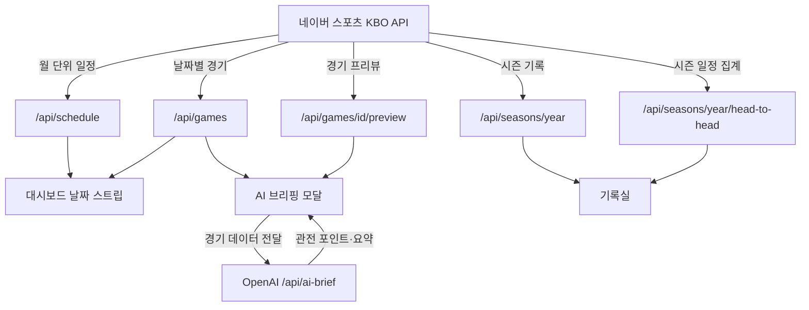

# KBO AI Brief

<p align="center">
  
  
  
  
  
</p>

KBO 리그의 경기 일정과 스코어, 팀 순위와 선수 기록, 연도별 기록실, 그리고 AI 관전
포인트를 한 화면에서 보는 야구 정보 대시보드입니다. 데이터는 네이버 스포츠 KBO API
에서 실시간으로 받아옵니다.

---

## 주요 기능

### 날짜별 경기 일정

- 월 단위 날짜 스트립에서 좌우로 달을 옮기며 날짜를 고릅니다
- **경기가 있는 날은 점으로 표시**하고, 없는 날(월요일·비시즌)은 흐리게 처리합니다
- 지난 날짜는 실제 스코어와 종료 상태를, 앞 날짜는 선발 대진을 보여줍니다
- 30초마다 자동으로 새로고침합니다

### AI 프리뷰 — 키플레이어 비교와 HOT/COLD ZONE

- 양 팀에서 **최근 흐름이 좋은 타자**를 한 명씩 뽑아 나란히 비교합니다
  (타율·안타·홈런·타점)
- **상대 팀 상대 성적**과 **최근 5경기** 성적을 함께 보여줍니다
- **HOT & COLD ZONE**: 스트라이크 존 3×3 과 바깥 네 구석의 존별 타율을 색 단계로
  나타냅니다. 칸에 커서를 올리면 그 존의 삼진 비율도 나옵니다
- 시즌 상대전적, OpenAI 기반 관전 포인트 / 경기 요약 브리핑을 같이 제공합니다

### 기록실 (`/records`) — 2008~2026 연도별 기록

- 연도 네비게이터로 2008 시즌부터 현재까지 오갑니다. `?year=2015` 로 URL 공유 가능
- 다섯 개 탭: **팀 순위 · 팀 기록 · 상대전적 · 타자 기록 · 투수 기록**
- **팀간 상대전적 10×10 매트릭스**: 어느 팀에 몇 승 몇 패인지 한눈에
- 끝난 시즌은 **정규시즌 순위와 최종 순위를 함께** 보여줍니다
  (예: 2015 정규시즌 1위 삼성, 한국시리즈 우승 두산)
- 과거 구단명(넥센·SK)도 같은 프랜차이즈의 현재 엠블럼으로 이어집니다

### 대시보드 사이드 패널

- 실시간 팀 순위, 선수 기록(투수·타자), 전년도 시즌 성적, 선수 검색

### 관심 구단 핀 고정

- 헤더에서 고른 구단의 경기가 목록 맨 위로 올라오고, 순위표에서도 강조됩니다
- `localStorage` 에 저장돼 다시 방문해도 유지됩니다

### 라이트 / 다크 테마

- 헤더의 해·달 버튼으로 전환합니다. 고른 적이 없으면 시스템 설정을 따릅니다
- 첫 페인트 전에 테마를 적용해 화면이 번쩍이지 않습니다

---

## 화면과 API

| 경로 | 설명 |
| --- | --- |
| `/` | 대시보드 — 날짜 스트립, 경기 카드, 팀 순위·선수 기록 패널 |
| `/records` | 기록실 — 연도별 팀·선수 기록과 상대전적 |
| `/games/[id]` | 경기 상세 — 이닝별 점수판, 라인업, 상대 전적 |

| API | 설명 |
| --- | --- |
| `GET /api/schedule?month=YYYY-MM` | 한 달치 일정 요약 (날짜별 경기 수) |
| `GET /api/games?date=YYYY-MM-DD` | 해당 날짜의 경기 목록 |
| `GET /api/games/[id]` | 경기 상세 |
| `GET /api/games/[id]/preview` | 키플레이어, 시즌 상대전적, HOT/COLD ZONE |
| `GET /api/standings` | 현재 시즌 팀 순위 |
| `GET /api/players` | 선수 기록 (투수·타자) |
| `GET /api/players/search?q=` | 선수 검색 |
| `GET /api/seasons/[year]` | 연도별 팀·타자·투수 기록 |
| `GET /api/seasons/[year]/head-to-head` | 연도별 팀간 상대전적 매트릭스 |
| `POST /api/ai-brief` | OpenAI 기반 경기 프리뷰 / 리뷰 생성 |

---

## 디자인

애플 HIG 와 토스를 레퍼런스로 삼은 밝고 정돈된 화면입니다. 색은
`src/app/globals.css` 에 CSS 변수로 한 번만 정의하고 컴포넌트는 시맨틱
클래스(`bg-surface`, `text-fg2`)만 쓰므로 모드별 분기 코드가 없습니다. 구단 엠블럼은
`src/lib/team-assets.ts` 한 곳에서 관리하고, 파일이 없으면 구단 상징색 배지로
자동으로 떨어집니다.

토큰 표, 크기 규칙, 엠블럼 교체 절차는 **[docs/DESIGN.md](docs/DESIGN.md)** 에,
에셋 출처와 라이선스는 **[public/teams/README.md](public/teams/README.md)** 에 있습니다.

---

## 데이터 출처

모든 경기·순위·선수 데이터는 네이버 스포츠 KBO API 에서 옵니다. 문서가 없는
비공개 API 라 동작을 직접 확인해 가며 쓰고 있고, 함정이 여럿 있습니다 —
`?date=` 파라미터가 무시된다거나, 일정 API 가 시범경기·포스트시즌을 구분해 주지
않는다거나 하는 것들입니다. 정리한 내용은 **[docs/DATA-SOURCES.md](docs/DATA-SOURCES.md)**
에 있습니다.



---

## 로컬 실행

```bash
npm install
```

`.env.local` 에 OpenAI 키를 넣습니다. AI 브리핑을 쓰지 않을 거라면 없어도 나머지
기능은 동작합니다.

```env
OPENAI_API_KEY=sk-...
```

```bash
npm run dev
```

[http://localhost:3000](http://localhost:3000) 에서 확인합니다.

---

## 알려진 제약

- **`npm run build` 가 타입체크에서 실패합니다.** `prisma.config.ts` 가
  `prisma/config` 를 찾지 못합니다. prisma 패키지가 설치돼 있지 않은데,
  `src/lib/prisma.ts` 는 Phase 1 더미(`null`)라 DB 를 쓰지 않습니다.
  컴파일 자체는 통과합니다
- **경기 상세(`/games/[id]`)가 실제 경기로 열리지 않습니다.** 목록 API 는 네이버
  경기 ID 를 주는데 상세 라우트는 하드코딩된 목업 ID 만 알고 있습니다
- **`/standings` 페이지가 500 입니다.** 위의 prisma 더미 때문입니다.
  같은 내용은 대시보드와 기록실에서 볼 수 있습니다
- 선수 기록은 네이버가 주는 **시즌별 상위 50명**까지입니다. 팀 기록은 2008,
  선수 기록은 2007 시즌이 하한이고 그 이전은 API 가 주지 않습니다
- 구단 엠블럼은 각 구단 등록상표입니다. 수익이 붙는 서비스로 운영하려면
  별도 라이선스가 필요합니다 (자세한 내용은 `public/teams/README.md`)

---

## 라이선스

MIT License
