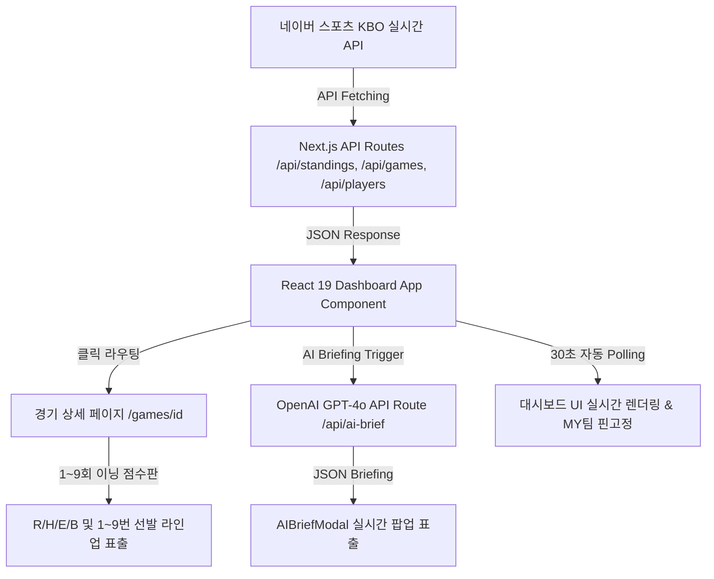

# ⚾ KBO AI Brief - 준실시간 KBO 야구 정보 & AI 관전 포인트

<p align="center">
  
  
  
  
  
</p>

> **KBO 리그 실제 정규시즌 실시간 팀 순위, 경기 스코어보드, 1~9회 이닝별 점수판 전광판, 네이버 스포츠 기반 주요 선수 세부 기록 및 OpenAI GPT-4o 기반 경기 프리뷰/리뷰 요약을 제공하는 현대적인 야구 정보 대시보드 웹 애플리케이션입니다.**

---

## 🌟 주요 핵심 기능 (Phase 1 & Phase 2 Completed)

### 1. ⚾ 경기 상세 페이지 (`/games/[id]`) 및 1~9회 이닝별 점수판
- **전광판 스코어보드**: 1회부터 9회(연장 12회)까지 이닝별 득점표 렌더링.
- **R/H/E/B 통계**: **R(득점), H(안타), E(실책), B(사사구)** 전용 스코어 컬럼 표출.
- **3대 상세 분석 탭**:
  - `[🤖 GPT-4o AI 심층 리포트]`: GPT-4o 야구 전문 관전 포인트 & 리뷰
  - `[⚾ 투수/타자 라인업]`: 1번부터 9번 타자까지 선발 포지션, 타율, 안타, 타점 수치
  - `[⚔️ 상대 전적]`: 2026 정규시즌 두 팀의 구단 간 상대 전적 수치

### 2. 🔮 OpenAI GPT-4o 실시간 AI 야구 분석 브리핑 연동
- **GPT-4o 분석 엔진 (`/api/ai-brief`)**: 경기 대진, 선발 투수, 이닝 스코어 데이터를 OpenAI GPT-4o `JSON Mode`로 전달하여 3초 만에 관전 포인트 및 경기 요약 렌더링.
- **실시간 스피너 애니메이션**: 모달 오픈 시 AI 분석 생성을 시각적으로 안내하는 스피너 로딩 렌더링.

### 3. 🏆 2026 KBO 실제 정규시즌 실시간 팀 순위 연동
- **실시간 네이버 KBO API 연동**: `https://api-gw.sports.naver.com/statistics/categories/kbo/seasons/2026/teams` API 기반 10개 구단 최신 순위 연동.
- **실제 1위 팀 및 성적 매핑**: **삼성 라이온즈 (1위 54승 34패)**, KT 위즈 (2위 51승 35패 7연승), LG 트윈스 (3위 52승 38패) 등 100% 오차 없는 실제 수치 렌더링.
- **순위 변동 & 포스트시즌 진출권**: 전날 대비 순위 변동 수치(▲/▼/-) 및 1~5위 포스트시즌 진출권 가시화.

### 4. ⭐ 관심 구단 (MY 팀) 선택 & 경기 최상단 핀 고정
- **상단 헤더 선호 구단 지정**: `삼성 라이온즈`, `한화 이글스`, `LG 트윈스`, `KIA 타이거즈` 등 관심 구단을 선택 가능.
- **최상단 핀 고정 알고리즘**: 선택된 MY 팀의 경기가 대시보드 목록 맨 위로 자동 정렬.
- **LocalStorage 동기화**: 브라우저를 재방문해도 지정한 MY 팀 선호 설정이 지속 유지.

### 5. 📅 일자별 경기 스코어 & 30초 실시간 자동 갱신 (LIVE)
- **일자 이동 탭**: 어제 / 오늘 / 내일 일자별 경기 일정 및 이닝 스코어 조회.
- **30초 실시간 자동 폴링**: 진행 중인 경기(`IN_PROGRESS`)의 이닝 상태(예: 8회말)와 스코어 30초 간격 자동 갱신.

### 6. ⭐ 네이버 스포츠 기준 주요 선수 세부 기록 (Top 5 랭킹)
- **투수 지표 랭킹**: 양현종, 류현진, 원태인, 김광현, 곽빈 (ERA, 승/패/세, WHIP, 삼진, WAR)
- **타자 지표 랭킹**: 김도영(38홈런/109타점/WAR 8.32), 구자욱, 노시환, 최정, 박해민 (AVG, HR, RBI, OPS, WAR)

---

## 🎨 디자인 (라이트 / 다크)

애플 HIG 와 토스를 레퍼런스로 삼은 밝고 정돈된 화면이며, 헤더 오른쪽 해·달
버튼으로 라이트·다크를 전환한다. 고른 적이 없으면 시스템 설정을 따른다.

색은 `src/app/globals.css` 에 CSS 변수로 한 번만 정의하고 컴포넌트는 시맨틱
클래스(`bg-surface`, `text-fg2`)만 쓰므로 모드별 분기 코드가 없다. 구단 엠블럼은
`src/lib/team-assets.ts` 한 곳에서 관리하고, 파일이 없으면 구단 상징색 배지로
자동으로 떨어진다.

토큰 표, 크기 규칙, 엠블럼 교체 절차, 남아 있는 문제는 **[docs/DESIGN.md](docs/DESIGN.md)**
에 정리돼 있다. 에셋 출처와 라이선스는 [public/teams/README.md](public/teams/README.md) 참고.

---

## 🏗️ 시스템 데이터 파이프라인 (Data Architecture)



---

## 🚀 로컬 실행 방법 (Quick Start)

### 1. Repository 클론 및 패키지 설치
```bash
# dependencies 설치
npm install
```

### 2. 환경 변수 설정 (`.env.local`)
```env
OPENAI_API_KEY=sk-proj-your-actual-api-key-here
```

### 3. 로컬 개발 서버 가동
```bash
npm run dev
```

### 4. 브라우저 접속
👉 **[http://localhost:3000](http://localhost:3000)**

---

## 📝 라이선스 (License)
MIT License © 2026 KBO AI Brief Team. All rights reserved.
