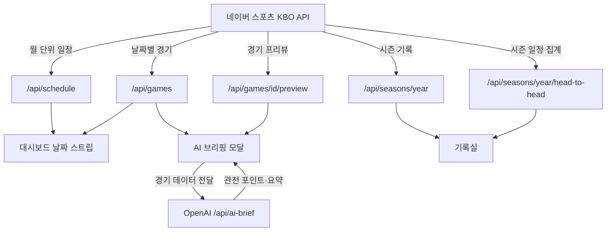

# KBO AI Brief

<p align="center">
  
  
  
  
  
</p>

KBO 리그의 경기 일정과 스코어, 팀 순위와 선수 기록, 연도별 기록실, 그리고 AI 관전
포인트를 한 화면에서 보는 야구 정보 대시보드입니다. 데이터는 네이버 스포츠 KBO API
에서 실시간으로 받아옵니다.

> **개인 학습용 프로젝트입니다.**
>
> 이 앱은 네이버 스포츠의 **문서화되지 않은 비공개 API** 에 의존합니다. 공식 제휴나
> 데이터 라이선스가 없고, 네이버·KBO 와 아무 관계가 없습니다. 규격이 바뀌면 예고 없이
> 깨집니다.
>
> 경기 기록·순위 같은 **사실 자체는 저작권 대상이 아니지만**, 그것을 모아 만든
> 데이터베이스와 구단 엠블럼에는 별도의 권리가 있습니다. 그래서 **공개 서비스로
> 운영하거나 수익을 붙이려면 정식 데이터 라이선스가 필요합니다.** KBO 공식 기록은
> 스포츠투아이가 만들고 공급합니다.
>
> 선수 사진은 초상권 때문에 쓰지 않습니다. 구단 엠블럼은 각 구단의 등록상표이며
> 출처와 전제를 [public/teams/README.md](public/teams/README.md) 에 적어 두었습니다.
> `src/lib/team-assets.ts` 에서 `logo` 를 `null` 로 두면 구단 상징색 배지로 떨어집니다.
>
> 외부 API 를 부를 때 브라우저인 척하지 않습니다. `src/lib/naver.ts` 에서 앱 이름을
> 그대로 적은 User-Agent 를 보내고, 끝난 시즌은 30일 캐시해서 호출 자체를 줄입니다.

---

## 주요 기능

### 날짜별 경기 일정

- 월 단위 날짜 스트립에서 좌우로 달을 옮기며 날짜를 고릅니다
- **경기가 있는 날은 점으로 표시**하고, 없는 날(월요일·비시즌)은 흐리게 처리합니다
- 지난 날짜는 실제 스코어와 종료 상태를, 앞 날짜는 선발 대진을 보여줍니다
- 30초마다 자동으로 새로고침합니다

### 경기 상세 — 실시간 중계

- **볼카운트(B/S/O)와 주자 상황**을 다이아몬드로 표시하고 10초마다 갱신합니다
- 현재 투수·타자의 오늘 성적, 통산 맞대결, 대기타석
- 네이버가 계산한 **실시간 승리 확률**
- 이닝별 점수판과 R·H·E·B, 교체 선수까지 포함한 타순과 투수 기록

### 투구 위치 — 스트라이크존

- 구장에서 측정한 **투구 추적 데이터**로 투수별 투구 분포를 존 위에 그립니다.
  루킹 스트라이크·헛스윙·파울·타격·볼을 색으로 구분합니다
- 구속과 통과 위치는 릴리스 시점의 속도 벡터와 궤적에서 직접 계산합니다.
  투구수, 최고·평균 구속, 존 통과율, 헛스윙 비율을 함께 보여줍니다
- 스트라이크존 상하한은 타자마다 다르므로 그 투수가 상대한 타자들의 중앙값으로
  상자를 그립니다
- 진행 중인 경기도 됩니다. 추적 데이터는 2017년 경기부터 있습니다

### 선수 비교

- 두 선수를 좌우에 두고 **통산 기록을 맞댑니다**. 항목마다 앞선 쪽이 굵게 표시됩니다
- 시대가 다르면 기록도 달라지므로 그 선수가 뛴 **각 시즌의 리그 평균으로 보정한**
  ERA+ · OPS+ 를 함께 봅니다. 100 이 리그 평균입니다
- 누가 더 나은 선수인지 앱이 정하지 않습니다. 종합 점수로 뭉뚱그리면 가중치를
  저희가 정한 게 되는데 그럴 근거가 없습니다
- 네이버가 2007년 시즌부터 제공해서 그 전에 뛴 선수는 비교할 수 없습니다

### 순위 변동 그래프

- 기록실에서 **시즌 내내 순위가 어떻게 움직였는지**를 선 그래프로 봅니다.
  팀 칩을 누르면 그 팀 선만 진하게 남습니다
- 네이버에 일자별 순위 API 가 없어 정규시즌 일정을 날짜순으로 쌓아 만듭니다.
  승률 규정은 시즌마다 달라서 순위표와 대조해 알아냅니다
  (2009년은 무승부를 승률에 넣던 해입니다)

### 구단 페이지

- 순위표에서 구단 이름을 누르면 **월별 성적, 상대별 전적, 최근 10경기, 남은 일정,
  로스터**를 한 화면에서 봅니다
- 상대별 전적과 월별 성적은 기록실의 상대전적 매트릭스와 같은 정규시즌 구간을
  써서 순위표의 승·패·무와 정확히 맞습니다
- 로스터는 WAR 순이고, 선수 이름을 누르면 통산 기록으로 갑니다

### 매직넘버 / 트래직넘버

- 순위표에서 **정규시즌 1위**와 **포스트시즌 진출** 매직넘버를 함께 봅니다.
  확정·탈락도 표시합니다
- KBO 는 승수가 아니라 무승부를 뺀 승률로 순위를 매기므로, 흔히 쓰는
  "상대 최대 승수 - 내 승수 + 1" 공식 대신 가능한 결과를 직접 따져 구합니다
  (`docs/MAGIC-NUMBER.md`)

### 선수 상세 — 통산 기록

- 리더보드·검색·기록실에서 선수 이름을 누르면 **연도별 기록과 통산 합계**를 봅니다
- 타자는 타율·출루·장타·OPS·wRC+·WAR 까지, 투수는 이닝·ERA·WHIP·WAR 까지 보여줍니다
- 통산 비율 지표는 더하지 않고 누적값에서 다시 계산합니다
- WAR 과 wRC+ 는 2017년부터만 제공돼서 그 전 시즌은 빈 칸으로 둡니다.
  추정으로 채우지 않습니다

### AI 프리뷰 — 키플레이어 비교와 HOT/COLD ZONE

- 양 팀에서 **최근 흐름이 좋은 타자**를 한 명씩 뽑아 나란히 비교합니다
  (타율·안타·홈런·타점)
- **상대 팀 상대 성적**과 **최근 5경기** 성적을 함께 보여줍니다
- **HOT & COLD ZONE**: 스트라이크 존 3×3 과 바깥 네 구석의 존별 타율을 색 단계로
  나타냅니다. 칸에 커서를 올리면 그 존의 삼진 비율도 나옵니다
- 시즌 상대전적, OpenAI 기반 관전 포인트 / 경기 요약 브리핑을 같이 제공합니다

### 기록실 (`/records`) — 2008~2026 연도별 기록

- 연도 네비게이터로 2008 시즌부터 현재까지 오갑니다. `?year=2015` 로 URL 공유 가능
- 다섯 개 탭: **팀 순위 · 팀 기록 · 상대전적 · 타자 기록 · 투수 기록**
- **팀간 상대전적 10×10 매트릭스**: 어느 팀에 몇 승 몇 패인지 한눈에
- 끝난 시즌은 **정규시즌 순위와 최종 순위를 함께** 보여줍니다
  (예: 2015 정규시즌 1위 삼성, 한국시리즈 우승 두산)
- 과거 구단명(넥센·SK)도 같은 프랜차이즈의 현재 엠블럼으로 이어집니다

### 우승 확률 예측 (`/predictions`)

- 남은 경기와 포스트시즌을 **20,000번 시뮬레이션**해 우승 확률을 냅니다
- 포스트시즌 진출 / 정규시즌 1위 / 한국시리즈 진출 / 우승 확률을 단계별로
- 전력 추정에 쓴 **피타고리안 승률, 실제 승률, 선수 WAR 뎁스를 모두 표에 노출**해
  어느 팀의 확률이 왜 그렇게 나왔는지 따라갈 수 있습니다
- 홈 승률(0.5196)과 피타고리안 지수(1.80)는 가정값이 아니라 2008~2025 실제 경기에서
  측정했습니다. 방법과 과거 18시즌 검증 결과는 [docs/PREDICTION.md](docs/PREDICTION.md)

### 대시보드 사이드 패널

- 실시간 팀 순위, 선수 기록(투수·타자), 전년도 시즌 성적, 선수 검색

### 관심 구단 핀 고정

- 헤더에서 고른 구단의 경기가 목록 맨 위로 올라오고, 순위표에서도 강조됩니다
- `localStorage` 에 저장돼 다시 방문해도 유지됩니다

### 라이트 / 다크 테마

- 헤더의 해·달 버튼으로 전환합니다. 고른 적이 없으면 시스템 설정을 따릅니다
- 첫 페인트 전에 테마를 적용해 화면이 번쩍이지 않습니다

---

## 화면과 API

| 경로 | 설명 |
| --- | --- |
| `/` | 대시보드 — 날짜 스트립, 경기 카드, 팀 순위·선수 기록 패널 |
| `/compare?a=&b=` | 선수 비교 — 통산 기록 맞대결 |
| `/teams/[code]` | 구단 상세 — 월별·상대별 성적, 일정, 로스터 |
| `/players/[id]` | 선수 상세 — 연도별 기록과 통산 합계 |
| `/records` | 기록실 — 연도별 팀·선수 기록과 상대전적 |
| `/predictions` | 우승 확률 — 시뮬레이션 기반 예측 |
| `/games/[id]` | 경기 상세 — 실시간 중계, 이닝별 점수판, 타순·투수 기록, 투구 위치 |

| API | 설명 |
| --- | --- |
| `GET /api/schedule?month=YYYY-MM` | 한 달치 일정 요약 (날짜별 경기 수) |
| `GET /api/games?date=YYYY-MM-DD` | 해당 날짜의 경기 목록 |
| `GET /api/games/[id]` | 경기 상세 |
| `GET /api/games/[id]/preview` | 키플레이어, 시즌 상대전적, HOT/COLD ZONE |
| `GET /api/games/[id]/pitches?home=&away=` | 투구 추적 데이터 (투수별 위치·구속) |
| `GET /api/standings` | 현재 시즌 팀 순위 |
| `GET /api/players` | 선수 기록 (투수·타자) |
| `GET /api/teams/[code]?year=` | 구단 상세 (월별·상대별 성적, 일정, 로스터) |
| `GET /api/players/[id]` | 선수 통산 기록 (연도별 타자·투수 성적) |
| `GET /api/players/search?q=` | 선수 검색 |
| `GET /api/seasons/[year]` | 연도별 팀·타자·투수 기록 |
| `GET /api/seasons/[year]/rank-history` | 일자별 순위 (순위 변동 그래프) |
| `GET /api/seasons/[year]/head-to-head` | 연도별 팀간 상대전적 매트릭스 |
| `GET /api/predictions/[year]` | 우승 확률 시뮬레이션 |
| `POST /api/ai-brief` | OpenAI 기반 경기 프리뷰 / 리뷰 생성 |

---

## 디자인

애플 HIG 와 토스를 레퍼런스로 삼은 밝고 정돈된 화면입니다. 색은
`src/app/globals.css` 에 CSS 변수로 한 번만 정의하고 컴포넌트는 시맨틱
클래스(`bg-surface`, `text-fg2`)만 쓰므로 모드별 분기 코드가 없습니다. 구단 엠블럼은
`src/lib/team-assets.ts` 한 곳에서 관리하고, 파일이 없으면 구단 상징색 배지로
자동으로 떨어집니다.

토큰 표, 크기 규칙, 엠블럼 교체 절차는 **[docs/DESIGN.md](docs/DESIGN.md)** 에,
에셋 출처와 라이선스는 **[public/teams/README.md](public/teams/README.md)** 에 있습니다.

---

## 데이터 출처

모든 경기·순위·선수 데이터는 네이버 스포츠 KBO API 에서 옵니다. 문서가 없는
비공개 API 라 동작을 직접 확인해 가며 쓰고 있고, 함정이 여럿 있습니다 —
`?date=` 파라미터가 무시된다거나, 일정 API 가 시범경기·포스트시즌을 구분해 주지
않는다거나 하는 것들입니다. 정리한 내용은 **[docs/DATA-SOURCES.md](docs/DATA-SOURCES.md)**
에 있습니다.


```mermaid
graph TD
    A[네이버 스포츠 KBO API] -->|월 단위 일정| B["/api/schedule"]
    A -->|날짜별 경기| C["/api/games"]
    A -->|경기 프리뷰| D["/api/games/id/preview"]
    A -->|시즌 기록| E["/api/seasons/year"]
    A -->|시즌 일정 집계| F["/api/seasons/year/head-to-head"]

    B --> G[대시보드 날짜 스트립]
    C --> G
    C --> H[AI 브리핑 모달]
    D --> H
    E --> I[기록실]
    F --> I

    H -->|경기 데이터 전달| J["OpenAI /api/ai-brief"]
    J -->|관전 포인트·요약| H
```

---

## 로컬 실행

```bash
npm install
```

`.env.local` 에 OpenAI 키를 넣습니다. AI 브리핑을 쓰지 않을 거라면 없어도 나머지
기능은 동작합니다.

```env
OPENAI_API_KEY=sk-...
```

```bash
npm run dev
```

[http://localhost:3000](http://localhost:3000) 에서 확인합니다.

---

## 알려진 제약

- 데이터는 네이버 스포츠의 **비공개 API** 에 의존합니다. 규격이 바뀌면 깨질 수
  있고, 서버에서 나가는 호출이라 배포 환경에 따라 차단될 수 있습니다
- 팀 기록은 2008, 선수 기록은 2007 시즌이 하한이고 그 이전은 API 가 주지 않습니다
- 구단 엠블럼은 각 구단 등록상표입니다. 수익이 붙는 서비스로 운영하려면
  별도 라이선스가 필요합니다 (자세한 내용은 `public/teams/README.md`)

---

## 라이선스

MIT License
